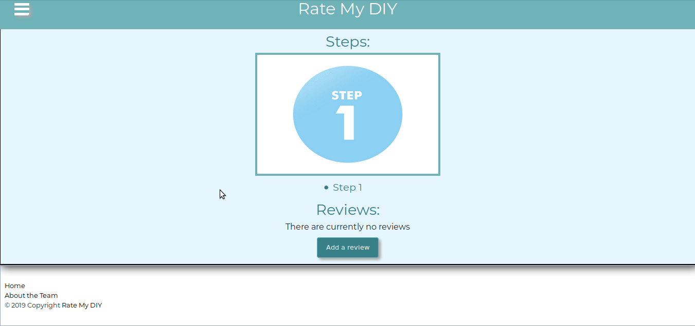

`youtube: Boq4KYMVrJs`

Rate My DIY was a 12 week long capstone project for my part-time cohort in Lambda School. This project was created by a 3 person team looking to solidify our understanding of concepts covered in Lambda's Full Stack Web Development program and branch out to explore new technologies. On the front end, we created a React application that employed react-apollo to connect to our server, Redux for state management, and Firebase for authentication. On the backend, we created a GraphQL server with graphql-yoga, accessed and managed through nexus-prisma. The scope of our project was fairly ambitious; along with learning many new technologies (GraphQL, Prisma, Nexus, Apollo, etc.), our app includes extensive functionality and many pages, which will be covered below:

[row][col]

Home page which aggregates featured projects (highest rated projects in the last month), popular makers (those who have been active on the site in the last month), and popular reviewers (reviewers whose reviews have amassed the most likes in the past month). This gif also highlights the nav sidebar functionality.

[/col][/row]

[row][col]

Profile page where a users' activity is displayed. This includes their projects and reviews, along with the projects that the user has rated and reviews that the user has liked.

[/col][/row]

[row][col]

Create Project page where users can create a project, including a title, a main image, steps and related images.

[/col][/row]

[row][col]

Create Review drop down functionality to review and rate projects.

[/col][/row]

[row][col]

Review modal with like and dislike functionality. Users may only like or dislike once and may only do one of the two.

[/col][/row]

[row][col]

Search functionality allowing users to search across the whole site for users, projects, and/or reviews. Further filtering of projects by rating and category. Sorting functionality for any/all selections.

[/col][/row]

[row][col]
<a href="https://alasallelabs.netlify.com/" target="_blank" rel="noopener noreferrer">Development Blog</a>

A blog that details my contributions to and general experience during the development of Rate My DIY.
[/col][/row]
