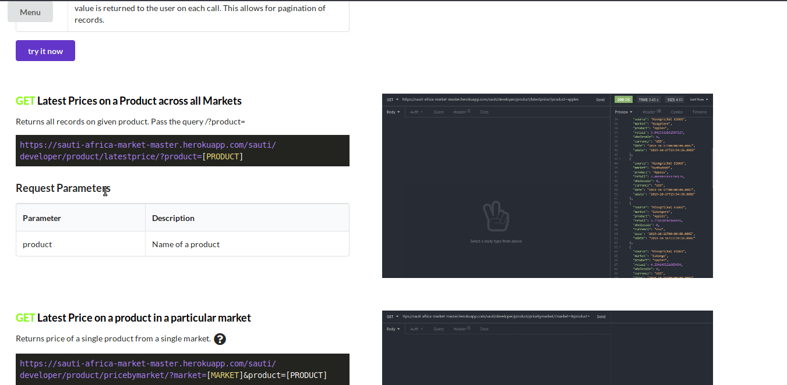
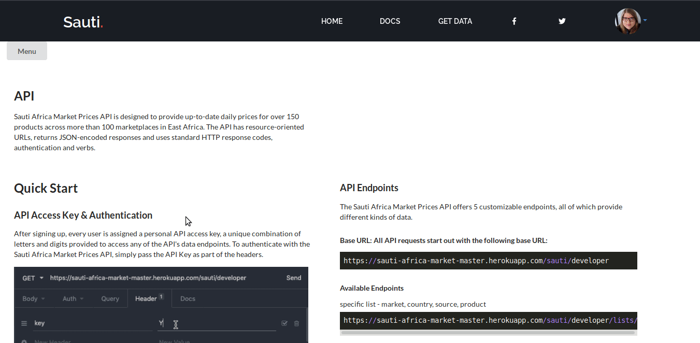
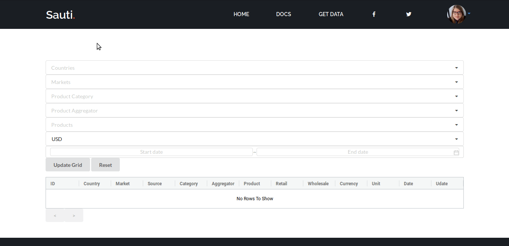
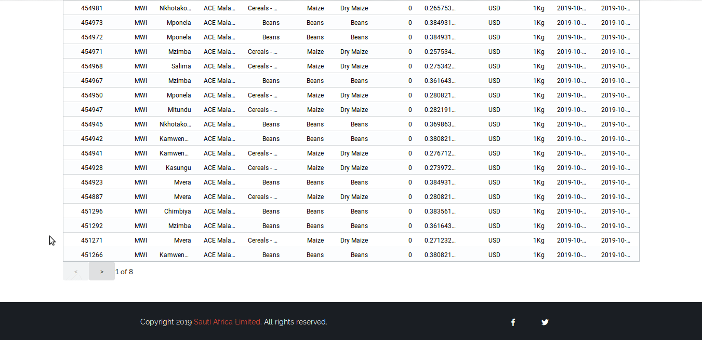
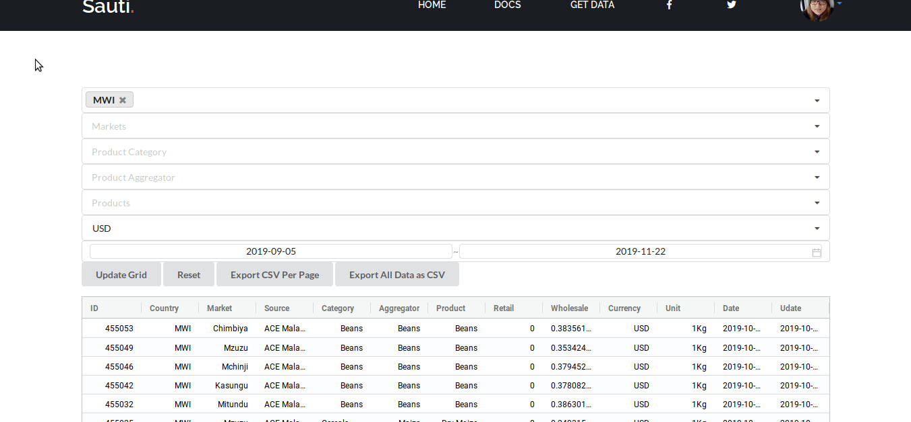
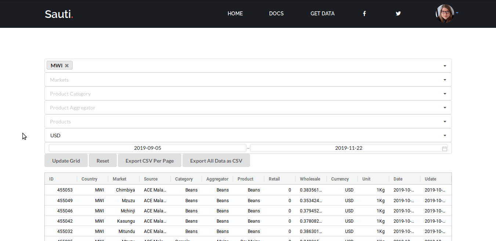
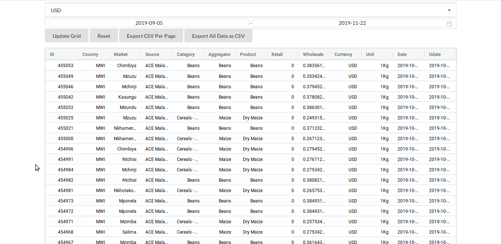

`youtube: -R4Y-uWfu2A`

Sauti Africa Market Price API was an 8 week long capstone project for a full-time cohort in Lambda School that I served as a Team Lead for. This project was created by an 8 person team for Sauti Africa, a company that provides a mobile-based trade information and social accountability platform for East Africa’s cross-border traders and entrepreneurs. Our goal was two-fold: the first goal was to provide Sauti Africa with an API serving serving their market price MySQL database, and the second was to provide a public-facing platform for the API so researchers can query the database and developers can have access to API documentation and manage their accounts. On the front end, we created a React application that employed ag-Grid for the filterable table and Auth0 for authentication. On the backend, we created a Node and Express server that allows for dynamic filters and cursor pagination. The main features and functionality of our public-facing platform are covered below:

[row][col]

The documentation page was modeled after popular API documentation like Twilio and Stripe. It includes a navigation button that will scroll to the associated section in the docs, sections for the API and the table, gifs that demonstrate functionality and results, and a section that goes over possible errors.

[/col][/row]

[row][col]

The documentation page also provides playgrounds for many of our endpoints so users can get a sense of how to interact with the API and examples of expected results.

[/col][/row]

[row][col]

On the table page, users can filter by multiple sections and sections can have multiple selections.

[/col][/row]

[row][col]

Cursor pagination is a key feature in our API. It eliminates repeated results when data is added or removed from the database and it is much quicker than offset pagination for large datasets. Our table page also employs Least Recently Used caching of results, which improves the speed of using our table.

[/col][/row]

[row][col]

The filterable table page also saves filter selections and results.

[/col][/row]

[row][col]

Users can export their current page of data to csv.

[/col][/row]

[row][col]

Users can also export the entire results of their query to csv.

[/col][/row]
